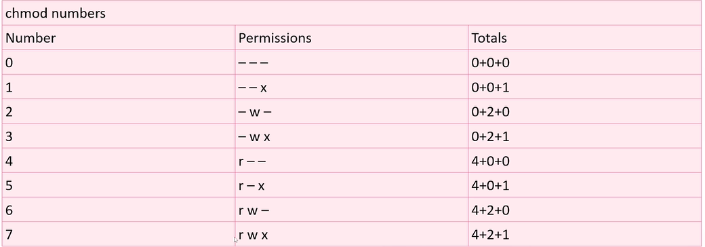

# Day1 Notes

<br>

>[!howtohack](https://tcm-sec.com/so-you-want-to-be-a-hacker-2022-edition/)

<br>

- We looked at some basics commands in linux; `pwd`, `~`, `cd`, navigations, etc.
<br>

- We went to `root(/)` of filesystems. And looked at TAB autocompletions.
<br>

- Talk about making directories at aournd `33:00` - `mkdir`, `/..`, `rmdir`, 

<br>

- Listing `ls`, `ls -la`
<br>

- [`explainshell.com`](https://explainshell.com) - resource to see different commands

<br>

- `@36:00` - we talk about `man` for different commands
<br>

- `echo` command  (Yep I am guilty of hitting up arrow)
<br>

- `cat` , `cp`, `mv` , redirection `>`
<br>

- `locate`, the small-brother of  `find` &... `updatedb` for locate (needed sudo privs for `locate`)
<br>

- `passwd` - changing user password
<br>

- `47:00` - __Users and Passwords__
    
    ```bash
    ┌──(kali㉿kali)-[~]
    └─$ ls -la
    total 2224
    drwxr-xr-x 20 kali kali    4096 Jun 22 22:07 .
    drwxr-xr-x  3 root root    4096 Feb 12 04:53 ..
    -rw-r--r--  1 kali kali       1 Feb 12 05:52 .bash_history
    -rw-r--r--  1 kali kali     220 Feb 12 04:53 .bash_logout
    -rw-r--r--  1 kali kali    5551 Feb 12 04:53 .bashrc
    -rw-r--r--  1 kali kali    3526 Feb 12 04:53 .bashrc.original
    drwx------  4 kali kali    4096 May 26 14:32 .BurpSuite
    drwxr-xr-x 11 kali kali    4096 May 27 14:08 .cache
    drwxr-xr-x 28 kali kali    4096 Jun 22 20:55 .config
    drwxr-xr-x  2 kali kali    4096 Feb 12 04:55 Desktop
    -rw-r--r--  1 kali kali      21 May 25 22:09 .dmrc
    drwxr-xr-x  2 kali kali    4096 Feb 12 04:55 Documents
    drwxr-xr-x  2 kali kali    4096 May 27 17:37 Downloads
    ```

    >arranged by : ___User:Group:All___

<br>

- `/tmp` folder gives all permissions to everyone - ~~__A good place to drop Malwares!__

<br>
<br>

- using `chmod` with `numerical` and `alphabetical` forms

<br>



- Remember `644`! a special number for `ssh keys` (private of course)

<br>
<br>

---

<br>


- Added _"mike"_ `adduser`, `/etc/passwd`, `unshadow` reference

<br>

 - [ ] you can  see what ___Services___ are running in `/etc/passwd` as well besides from the common `users`
 <br>

 - `sudoers` file in `/etc/sudoers`  
    >root ALL=(ALL:ALL) ALL
    >%sudo

<br>

- listing people in `sudoers` list :
        ```bash
        $  grep "sudo" /etc/groups
        ```
<br>

- `sudo -l ` reference

<br>

- ___dont't have a `root` password!!____. Give `sudo` privs instead . `REPEDIATION`


<br>

- Appending with `>>`

<br>

- `touch` to create new files, like `ni` in `Powershell`

<br>

- __Text editors__  : `nano` , `mousepad`  (we're in Kali)


---

___Done!!!___


----

Ends at `1:40:00` 
